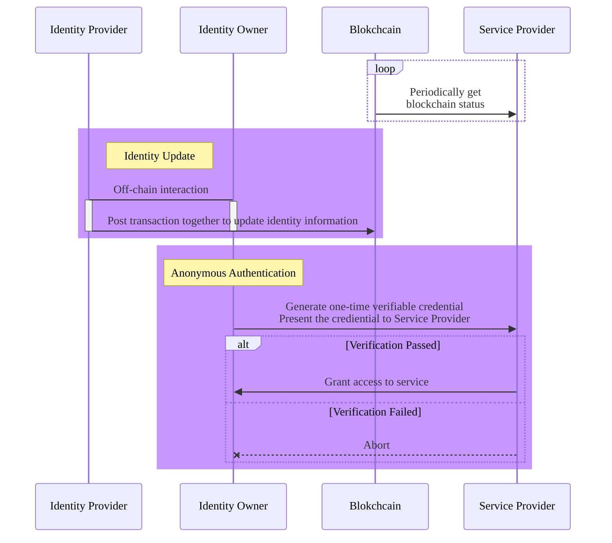

```mermaid
%%{init: {'themeVariables': { 'fontFamily': 'Times', 'fontSize': '16px'}}}%%
sequenceDiagram
    participant idp as Identity Provider
    participant ido as Identity Owner
    participant bc as Blokchcain
    participant sp as Service Provider
        loop
    bc ->> sp: Periodically get <br>blockchain status
    end
    rect rgb(200, 150, 255)
    note right of idp: Identity Update 
    idp -> ido: Off-chain interaction
    activate idp
    activate ido
    idp ->> bc : Post transaction together to update identity information
    deactivate idp
    deactivate ido
    %% Note over bc: Update Identity Information
    end
    %% par Get latest blockchain 
    %% and Present crediential
    rect rgb(200, 150, 255)
    note over ido: Anonymous Authentication
    %% ido ->> ido: 
    ido ->> sp: Generate one-time verifiable credential <br> Present the crediential to Service Provider
    alt Verification Passed
    sp ->> ido: Grant access to service
    else Verification Failed
    sp --x ido: Abort 
    end
    end
    %% end
```